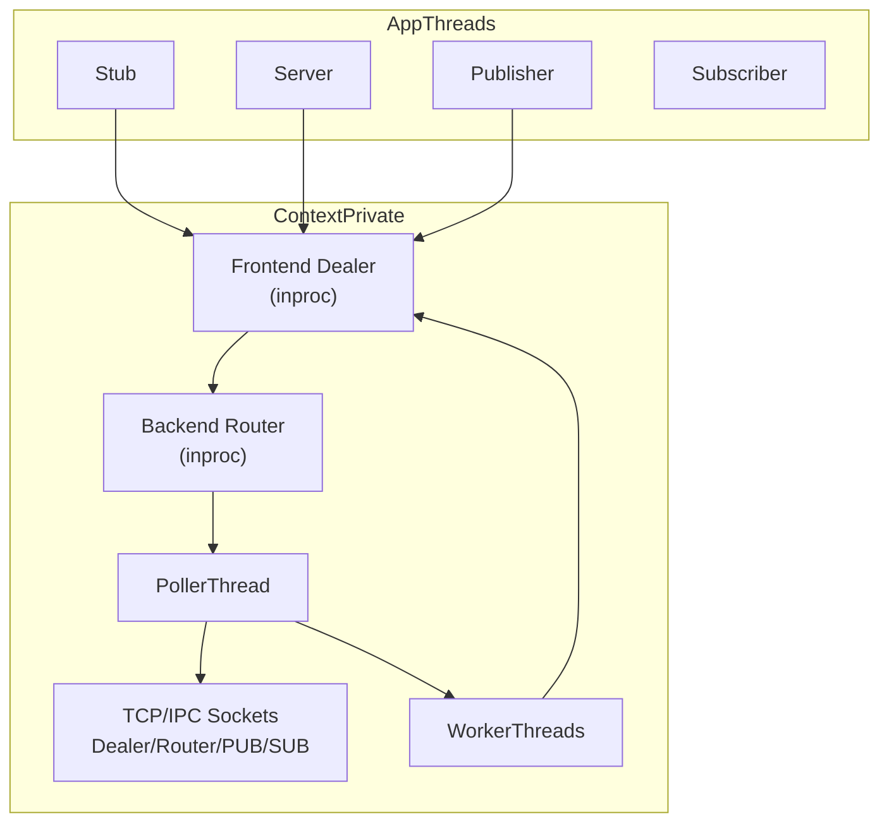

# zrpc 实现评审报告

## 架构总览

zrpc 是一个基于 ZeroMQ 的 C++ RPC / Pub-Sub 库，核心模式为 **Reactor（Poller 线程）+ Worker Pool（业务回调）+ 命令事件总线（inproc Router/Dealer）**。



**设计亮点（合理之处）：**

- I/O 与业务逻辑分离清晰：Poller 只做 `zmq_poll` 和路由，Worker 执行 RPC handler / 回调
- 单 `Context` 可管理多 Channel / Server / Pub-Sub，资源共享合理
- 对外 API 简洁（同步 `Rpc::wait()`），内部异步事件驱动，模式类似 Netty/Majordomo
- pimpl + `ZRPC_EXPORT` 隐藏实现，shared library 导出控制正确

---

## P0 — 正确性 Bug（需优先修复）

### 1. RPC 超时机制完全失效

[`Context.cpp`](src/zrpc/Context.cpp) 将 **相对超时毫秒数** 直接当作 **绝对时间戳** 传给 Poller：

```391:394:src/zrpc/Context.cpp
    if (event->timeoutMs > 0) {
        _poller->runCallbackAt(event->timeoutMs, [this, requestId]{
            handleClientRequestTimeout(requestId);
        });
```

Poller 用 `zclock_time()`（当前 epoch 毫秒）比较，任何 `timeoutMs > 0`（如 5000）都会 **立即触发**（因为 5000 ≪ 当前时间）。

**修复：** 改为 `runCallbackAt(zclock_time() + event->timeoutMs, ...)`，或 Poller 提供 `runAfter(delayMs, cb)` 语义。

### 2. Pub socket 生命周期不一致（remove 路径有误，add 路径是对的）

**结论：Pub socket 不需要加入 Poller。** 当前 `onAddPubEvent` 不注册 Poller 是正确设计；问题出在 `onRemovePubEvent` 多调了一次 `removeSocket`。

**原因：**

| Socket 类型 | 是否需要 Poller | 原因 |
|-------------|----------------|------|
| Client Dealer | 是 | 需要 poll 读取 RPC reply |
| Server Router | 是 | 需要 poll 读取 RPC request |
| Sub SUB | 是 | 需要 poll 读取推送消息 |
| **Pub PUB** | **否** | 只写不读；发布由 `PubTopicEvent` 驱动，在 Poller 线程里主动 `send` |

Pub 的数据流是：

```
用户线程 pubTopic()
  → PubTopicEvent（经 inproc backend）
  → Poller 线程 onPubTopicEvent()
  → 直接 write 到 _pubSockets[socketId]
```

PUB socket 从不产生 `ZMQ_POLLIN` 事件，加入 Poller 没有意义。

[`onRemovePubEvent`](src/zrpc/Context.cpp) 的错误代码：

```464:470:src/zrpc/Context.cpp
void ContextPrivate::onRemovePubEvent(RemovePubEvent *event)
{
    _poller->postCallback([this, socketId = event->socketId]{
        auto socket = std::move(_pubSockets[socketId]);
        _pubSockets.erase(socketId);
        _poller->removeSocket(socket.get());  // bug：该 socket 从未 add 过
    });
}
```

**修复：** 删除 `_poller->removeSocket(socket.get())` 这一行；保留从 `_pubSockets` 移除并 close socket 即可（`unique_ptr` 析构会 close）。`postCallback` 可保留，确保在 Poller 线程安全销毁。

### 3. 反序列化无校验，始终返回 true

[`Message.cpp`](src/zrpc/Message.cpp) 中 `deserialize()` 不检查 stream 状态/长度边界：

```38:44:src/zrpc/Message.cpp
bool RpcRequest::deserialize(zmq::message_t &msg)
{
    Deserializer deserializer(msg.to_string());
    deserializer >> serviceName;
    deserializer >> methodName;
    deserializer >> data;
    return true;  // 永远不失败
}
```

风险：恶意/损坏报文可导致 **超大 `resize(len)`**、读取垃圾数据、静默逻辑错误。

**修复：** 检查 `good()`/`eof()`、限制 `len` 上限、增加 magic/version 字段。

### 4. `Rpc` API 设计可简化（Stub 禁止并发的前提下）

**约束确认：** Stub 不允许并发调用；一次调用对应一次同步等待。在此前提下，**外部创建 `Rpc` 并传入 `callMethod` 不是最优设计**。

**当前 API 的问题：**

```cpp
// 用户必须手动管理两个对象 + 两步调用
zrpc::Rpc rpc;
rpc.setTimeout(5000);
stub.callMethod("Svc", "method", request, reply, &rpc);
rpc.wait();
if (rpc.ok()) { ... }
```

- `Rpc` 同时承担 **调用配置**（timeout）和 **调用结果**（status/error），职责混杂
- `signal()` / `setStatus()` 等同步原语暴露在 public API，属于实现细节泄漏
- `wait()` 的 `INACTIVE` 检查与 `ACTIVE` 枚举语义不一致，复用 `Rpc` 对象会失败
- 调用方样板代码多，且容易漏掉 `wait()`

**推荐方案（按优先级）：**

#### 方案 A — 阻塞式 `callMethod` + `CallResult`（推荐）

既然 Stub 串行、内部本来就是 sync-over-async，直接把等待内聚到 `callMethod`：

```cpp
struct CallResult {
    StatusCode status{StatusCode::OK};
    ApplicationError error{ApplicationError::NO_ERROR};
    std::string errorMessage;
    std::string reply;

    bool ok() const { return status == StatusCode::OK; }
};

// Stub 内部用栈上 CallState（mutex + cv）等待 worker 回调，用户无感知
CallResult Stub::callMethod(
    const std::string& serviceName,
    const std::string& methodName,
    const std::string& request,
    int64_t timeoutMs = -1);
```

调用变为：

```cpp
auto result = stub.callMethod("GreeterService1", "sayHello", request);
if (result.ok()) {
    std::cout << result.reply << std::endl;
}
```

- **删除 public `Rpc` 类**，或降级为 internal `CallState`（仅 Stub 可见）
- 去掉 `ACTIVE/INACTIVE/CANCELLED` 等未使用状态，只保留结果态
- `wait()` 不再需要；超时作为 `callMethod` 参数或 `CallOptions` 结构体

#### 方案 B — 保留 out-param，去掉外部 `Rpc`（改动最小）

若希望避免 `CallResult.reply` 的额外 move，可保留 `reply` 出参：

```cpp
StatusCode Stub::callMethod(
    const std::string& serviceName,
    const std::string& methodName,
    const std::string& request,
    std::string& reply,
    ApplicationError* appError = nullptr,
    std::string* errorMsg = nullptr,
    int64_t timeoutMs = -1);
```

内部同样在 `callMethod` 里栈分配 `CallState` 并阻塞等待。public API 不再出现 `Rpc*`。

#### 方案 C — 仅当未来需要 async 时才引入 `CallHandle`

若后续要支持异步，可在方案 A 基础上扩展，而不是保留现有 `Rpc`：

```cpp
CallResult callMethod(...);                          // 同步，主路径
std::future<CallResult> callMethodAsync(...);       // 异步，可选
```

`CallHandle` / `future` 由 Stub 内部创建并持有 per-call 状态；**仍不建议让用户自己 new/stack `Rpc`**。

**不推荐的做法：**

- 继续要求用户创建 `Rpc` 但加文档说"不能复用"—— API 仍容易误用
- 在 `Rpc` 上加 `reset()` 支持复用—— 增加状态机复杂度，收益有限
- 给 Stub 加 mutex 允许并发—— 与当前约束相反，且 ZMQ Dealer 顺序语义下并发调用本身就有问题

**内部实现要点（方案 A/B 共用）：**

```cpp
struct CallState {  // 原 Rpc 的内聚版本，不 export
    std::mutex mtx;
    std::condition_variable cv;
    bool ready{false};
    StatusCode status{StatusCode::OK};
    ApplicationError error{ApplicationError::NO_ERROR};
    std::string errorMessage;
    void wait() { ... }
    void complete(...) { ... signal cv ... }
};

void Stub::callMethod(...) {
    CallState state;  // 栈上，生命周期 = 本次调用
    event->clientFunc = [&state, &reply](...) { ... state.complete(...); };
    send event...
    state.wait();     // 阻塞用户线程
    // 填充 CallResult 或 out-param
}
```

Stub 非并发时，`CallState` 栈分配完全安全，无需 `Rpc` 堆对象。

**已确认决策：** 采用 **方案 A**；Stub 禁止并发；不保留 public `Rpc` 类。

---

## 修改建议汇总

以下按优先级列出具体改动项，含目标文件与预期改法，便于直接实施。

### 阶段一：P0 正确性 + API 重构（优先）

#### 1. 修复 RPC 超时

| 项 | 内容 |
|----|------|
| 文件 | [`src/zrpc/Context.cpp`](src/zrpc/Context.cpp)、可选 [`src/zrpc/Poller.h`](src/zrpc/Poller.h) |
| 问题 | `runCallbackAt(event->timeoutMs, ...)` 把相对毫秒当绝对时间戳 |
| 改法 A | `_poller->runCallbackAt(zclock_time() + event->timeoutMs, ...)` |
| 改法 B | Poller 新增 `runAfter(int64_t delayMs, Callback cb)`，内部计算绝对时间 |
| 验证 | 设置 `timeoutMs=3000`，server 延迟 5s 不响应，client 应在约 3s 返回 `DEADLINE_EXCEEDED` |

#### 2. 修复 Pub socket remove 路径

| 项 | 内容 |
|----|------|
| 文件 | [`src/zrpc/Context.cpp`](src/zrpc/Context.cpp) `onRemovePubEvent` |
| 问题 | 对从未 add 到 Poller 的 PUB socket 调用 `removeSocket` |
| 改法 | **删除** `_poller->removeSocket(socket.get())`；保留 `_pubSockets` erase + `unique_ptr` 析构 |
| 不改 | `onAddPubEvent` **不**加入 Poller（PUB 只写不读，设计正确） |

#### 3. 加固反序列化

| 项 | 内容 |
|----|------|
| 文件 | [`src/zrpc/Message.cpp`](src/zrpc/Message.cpp)、[`src/zrpc/Message.h`](src/zrpc/Message.h) |
| 改法 | `deserialize()` 检查 `_ss.good()` / 剩余字节；`len` 加上限（如 64MB）；失败返回 `false` |
| 改法 | 可选增加 `uint32_t magic + version` 帧头 |
| 联动 | [`Server.cpp`](src/zrpc/Server.cpp) 已有 `if (!deserialize)` 分支，改完即可生效 |

#### 4. 重构 Stub / Rpc API（方案 A）

| 项 | 内容 |
|----|------|
| 新增 | `CallResult` 结构体（放 [`Channel.h`](src/zrpc/Channel.h) 或独立 `Result.h`） |
| 修改 | [`Channel.h`](src/zrpc/Channel.h) / [`Channel.cpp`](src/zrpc/Channel.cpp)：`Stub::callMethod` 改为返回 `CallResult` |
| 删除 | public [`Rpc.h`](src/zrpc/Rpc.h) / [`Rpc.cpp`](src/zrpc/Rpc.cpp)（或移为 internal `CallState`，不 install） |
| 内部 | `CallState` 栈分配：`mutex + cv + status + error`；`callMethod` 内 send event → `state.wait()` → 返回 |
| 清理 | 删除 `StatusCode::ACTIVE/INACTIVE/CANCELLED/TERMINATED` 中未使用的枚举值 |
| 约束 | 文档注明：**同一 Stub 不可并发调用**（无需加锁） |

**API 变更对比：**

```cpp
// Before
zrpc::Rpc rpc;
rpc.setTimeout(5000);
stub.callMethod(svc, method, req, reply, &rpc);
rpc.wait();

// After
auto result = stub.callMethod(svc, method, req, /*timeoutMs=*/5000);
if (result.ok()) { use(result.reply); }
```

**需同步修改的文件：**

- [`include/zrpc/Channel.h`](include/zrpc/Channel.h)、[`include/zrpc/Rpc.h`](include/zrpc/Rpc.h)（删除或替换）
- [`tests/test_zrpc_client.cpp`](tests/test_zrpc_client.cpp) 全部 client 调用
- [`src/zrpc/CMakeLists.txt`](src/zrpc/CMakeLists.txt) 安装头文件列表

---

### 阶段二：P1 设计改进

#### 5. Context API 边界

| 项 | 内容 |
|----|------|
| 文件 | [`src/zrpc/Context.h`](src/zrpc/Context.h) |
| 改法 | 移除 public `friend` 和 `d()`；在 [`ContextPrivate.h`](src/zrpc/ContextPrivate.h) 提供 internal accessor |
| 改法 | Channel/Server/PubSub 仅 include internal header（不 install） |

#### 6. Service 生命周期

| 项 | 内容 |
|----|------|
| 文件 | [`src/zrpc/Server.h`](src/zrpc/Server.h)、[`Server.cpp`](src/zrpc/Server.cpp) |
| 改法 | `registService(Service*)` → `registerService(std::shared_ptr<Service>)` 或内部持有副本 |
| 改法 | `findMethod` 改为 `bool findMethod(name, Method& out)` 或 `std::optional` |

#### 7. Subscriber topic 过滤

| 项 | 内容 |
|----|------|
| 文件 | [`src/zrpc/Context.cpp`](src/zrpc/Context.cpp) `onAddSubEvent`、[`PubSub.cpp`](src/zrpc/PubSub.cpp) |
| 改法 | 构造 Subscriber 时传入 topics，对每个 topic 调用 `subSocket->set(zmq::sockopt::subscribe, topic)` |
| 改法 | 移除 `subscribe("")` 和应用层 `std::find` 过滤（或仅作二次校验） |

#### 8. 多 Context 支持

| 项 | 内容 |
|----|------|
| 文件 | [`src/zrpc/Context.cpp`](src/zrpc/Context.cpp) |
| 改法 | `_backendAddr` 改为 `inproc://zrpc_<instanceId>`，构造时生成唯一 id |

#### 9. 命名修正

| 旧 | 新 | 文件 |
|----|-----|------|
| `registService` | `registerService` | Server.h/cpp |
| `clinetSocketId` | `clientSocketId` | Event.h, Context.cpp, Channel.cpp |
| `NACTIVE` | `INACTIVE` | Event.h（若仍保留 RpcRequestStatus） |

---

### 阶段三：P2 性能

| 项 | 文件 | 改法 |
|----|------|------|
| 序列化零拷贝 | Message.cpp | 直接写入 `zmq::message_t` buffer，避免 `stringstream → string → message_t` |
| 大消息 | Channel.cpp, Message | 评估 multipart 或引用传递，减少 24MB 级 payload 拷贝 |
| Worker 调度 | Context.cpp | 按 `requestId % N` 或 socketId hash 分发，减少 callback 拷贝 |
| ZMQ 调优 | Context.cpp socket 创建处 | 配置 `ZMQ_SNDHWM/RCVHWM`、TCP keepalive |
| 日志 | 全局 | `std::cout` 替换为可关闭的 logger macro |
| 字节序 | Message.h, utils.h | 统一 little-endian 或引入 protobuf（跨平台需求时） |

---

### 阶段四：P3 工程化

| 项 | 改法 |
|----|------|
| CMake | 去掉硬编码路径；`find_package(cppzmq)` / `pkg-config`；GLOB 仅 `.cpp` |
| 测试 | 补充 Message 序列化/反序列化单元测试；RPC 超时集成测试；Stub API 变更测试 |
| 文档 | README：架构图、线程模型、Stub 不可并发、inproc 单进程限制 |
| 错误处理 | `SocketWriter::write` 失败时 propagate error 到 `CallResult` |
| 内存 | d-pointer 改 `unique_ptr` |

---

### 明确不改 / 低优先级

| 项 | 说明 |
|----|------|
| Pub socket 加入 Poller | **不需要**，当前 add 路径正确 |
| Stub 并发加锁 | **不做**，约束为单线程串行调用 |
| raw pointer 传 Event | 短期保留（inproc 单进程），文档说明边界；长期再改 serializable command |
| public Rpc 保留 | **删除**，改为 internal CallState |

---

## P1 — 设计不合理之处（详述）

### 5. 通过 ZMQ 传输 raw pointer（仅适合单进程）

[`utils.h`](src/zrpc/utils.h) 的 `writePtr/readPtr` 将 `Event*` 指针值写入 ZMQ frame：

```78:82:src/zrpc/utils.h
    bool writePtr(void *ptr, ...) {
        zmq::message_t msg(sizeof(ptr));
        memcpy(msg.data(), &ptr, sizeof(ptr));
```

- 只能在 **同进程 inproc** 场景工作
- 无类型安全，worker 端 `static_cast` 依赖发送端类型正确
- 若未来跨进程，会直接崩溃

**建议：** 内部 inproc 可保留，但应明确文档边界；长期可改为 serializable command + 对象池，或直接用 `zmq::socket_t` + 内存队列在同线程传递。

### 6. 公共 API 泄露内部实现

[`Context.h`](src/zrpc/Context.h) 对外暴露大量 `friend` 和 `d()` 返回 `ContextPrivate*`，使 Channel/Server 等与 Context 强耦合：

```17:29:src/zrpc/Context.h
    friend class Server;
    friend class Channel;
    // ... 8 个 friend
    ContextPrivate *d() { return _d; }
```

**建议：** 将 `d()` 移到 internal header（如 `ContextPrivate.h` 中的 free function 或 internal 基类），公共头只保留 `Context/Channel/Server/...` 用户 API。

### 7. Service 生命周期非 owning

[`Server.cpp`](src/zrpc/Server.cpp) 存储 `Service*` 裸指针，调用方必须保证 Service 比 Server 活得久。无注册/注销 API。

**建议：** 支持 `shared_ptr<Service>` 或 `unique_ptr` 注册；析构时自动 unbind。

### 8. `findMethod` 返回 static 空 Method 的引用

```15:19:src/zrpc/Server.cpp
const Service::Method &Service::findMethod(const std::string &name)
{
    static Method emptyMethod;
    return iter != _methods.end() ? iter->second : emptyMethod;
}
```

当前靠 `if (method)` 判断，但 `std::function` 的 truthiness 依赖实现，是隐患 footgun。

**建议：** 返回 `optional<Method&>` 或 `bool findMethod(name, Method& out)`。

### 9. Subscriber 订阅策略低效

[`onAddSubEvent`](src/zrpc/Context.cpp) 使用 `subscribe("")` 接收全部消息，在 Worker 中做 topic 过滤：

```475:477:src/zrpc/Context.cpp
    subSocket->set(zmq::sockopt::subscribe, "");
```

高吞吐多 topic 场景下，所有订阅者都会收到全部消息再过滤，网络和 CPU 浪费。

**建议：** 对每个 topic 调用 `zmq::sockopt::subscribe`；动态 topic 可用 prefix 订阅。

### 10. 固定 inproc 地址，不支持多 Context

[`Context.cpp`](src/zrpc/Context.cpp) 硬编码 `inproc://context_backend`，同进程多个 `Context` 实例会冲突。

**建议：** 构造时生成唯一 UUID 地址，或使用 `inproc://zrpc_<pid>_<id>`。

---

## P2 — 性能优化点

| 区域 | 现状 | 建议 |
|------|------|------|
| 序列化 | `stringstream` → `string` → `zmq::message_t`，多次拷贝 | 直接写入 `zmq::message_t` 或 reusable buffer |
| 大消息 | [`test_zrpc_client.cpp`](tests/test_zrpc_client.cpp) 测试 24MB payload，全量 string 拷贝 | 支持 zero-copy / multipart / 流式传输 |
| Worker 调度 | Round-robin + 每次拷贝 `std::function` / `ServerFunc` | 按 socketId/requestId hash 保序；减少 callback 拷贝 |
| Poller | `_dirty` 时 rebuild 全部 pollitems | socket 少时可接受；高连接数时用 epoll/kqueue 或 zmq 的 proxy 模式 |
| 日志 | 热路径大量 `std::cout` | 可插拔 logger + level；默认关闭 debug |
| ZMQ 选项 | 未设置 HWM/LINGER/TCP keepalive | 生产环境需配置，防止慢消费者堆积 |

### 字节序与跨平台

[`Message.h`](src/zrpc/Message.h) 和 [`utils.h`](src/zrpc/utils.h) 使用 native endian 写 fundamental type，**跨架构 RPC 会出错**。若有多平台需求，应统一 little-endian 或 protobuf。

---

## P3 — API / 工程化改进

- **命名：** `registService` → `registerService`；`clinetSocketId` → `clientSocketId`；`NACTIVE` → `INACTIVE`
- **Rpc::wait()：** 应支持 `wait_for(timeout)`，与 RPC 超时联动；当前用户线程可能无限阻塞（timeout=-1 时）
- **错误处理：** `SocketWriter::write` 返回值未检查；send 失败静默丢失
- **StatusCode：** `ACTIVE/CANCELLED/TERMINATED` 未使用，应实现或删除
- **内存管理：** d-pointer 用手动 `new/delete`，建议 `unique_ptr` 提升异常安全
- **CMake：** [`CMakeLists.txt`](src/zrpc/CMakeLists.txt) 硬编码本机路径；GLOB 把头文件编进 target；应用 `find_package(cppzmq)` / `pkg-config`
- **测试：** 仅有手动 integration test，无单元测试；`test_zrpc.cpp` 为空
- **文档：** README 缺失，wire protocol / 线程安全契约未说明

---

## 总体评价

| 维度 | 评分 | 说明 |
|------|------|------|
| 架构 | 良好 | Reactor + Worker 适合 ZMQ RPC，职责划分清楚 |
| 正确性 | 需加强 | 超时 bug、反序列化、Pub 生命周期是硬伤 |
| API 设计 | 中等 | 简洁但 Rpc 生命周期语义不清、friend 泄漏 |
| 性能 | 中等 | 小消息够用；大 payload / 高 QPS 有多处拷贝瓶颈 |
| 可维护性 | 偏低 | 日志、测试、CMake 便携性、文档不足 |

**定位建议：** 当前实现适合作为 **单机/同进程 ZeroMQ RPC 原型或内部工具**；若要用于生产分布式 RPC，需先修复 P0 问题，并补齐序列化校验、超时语义、线程安全文档和测试。

---

## 建议修复路线图


| 阶段 | 内容 | 预估 |
|------|------|------|
| **阶段一 P0** | 超时 bug、Pub remove、deserialize 校验、Stub→CallResult API 重构、更新 tests | 1-2 天 |
| **阶段二 P1** | Context internal 化、Service owning、Sub ZMQ 过滤、命名修正、多 Context | 2-3 天 |
| **阶段三 P2** | 序列化优化、日志、ZMQ HWM、Worker 调度 | 按需 |
| **阶段四 P3** | 单元测试、CMake 便携化、README、错误传播 | 按需 |
