# zrpc 设计

## 1. 概述

zrpc 提供同进程内的 unary RPC 和尽力而为的 topic 分发。公开类型只有 `Context`、`Client`、`Server` / `Service`、`Publisher` / `Subscriber`、`CallHandle`。

ZeroMQ socket 不是线程安全的，因此 **一条 poller 线程独占全部对外 socket**；method 与用户回调在 worker 池上执行。应用线程、poller、worker 之间用 inproc 投递 `Event*` 驱动，不共享可变状态。RPC 走 DEALER / ROUTER，按 `requestId` 多路复用。运输层是 TCP（有重传和保序）；RPC 层是 **at-most-once**：一次调用要么成功一次，要么失败，库不自动重发已送出的请求。

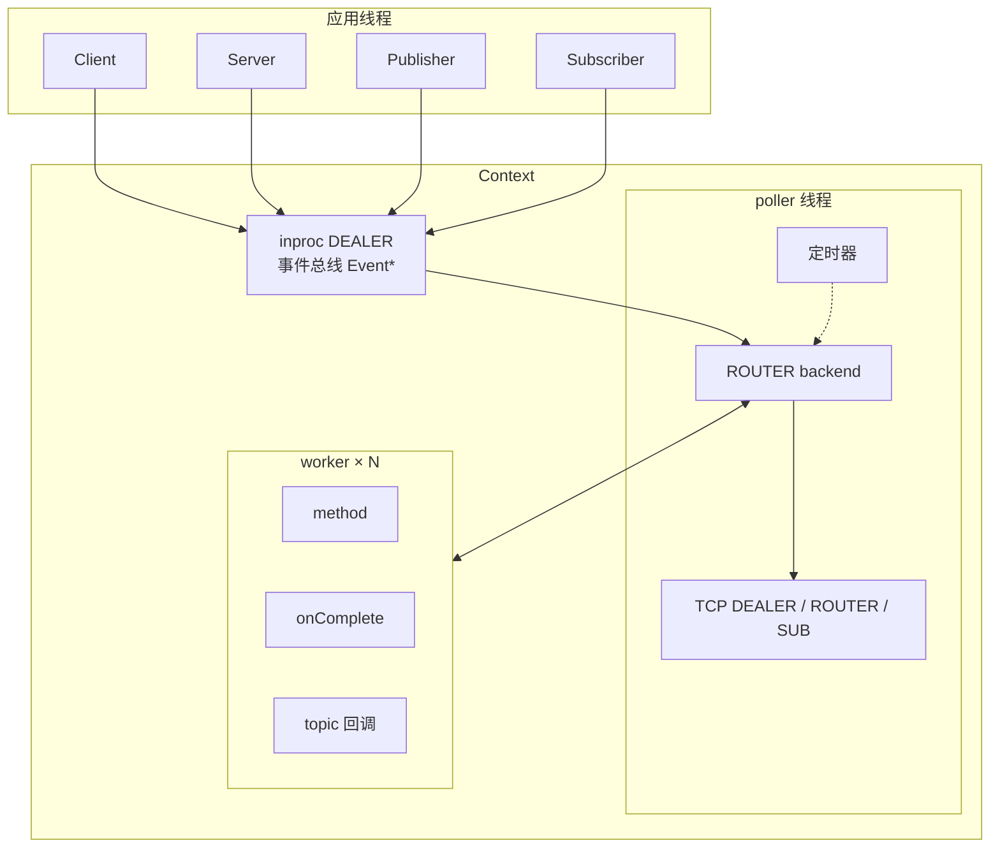

| 层 | 职责 |
|----|------|
| 公开对象 | 组包，把 `Event*` 丢进各自的 inproc dealer；打开 / 关闭等 ack |
| poller | 唯一碰对外 socket 的线程：分发 Event、收发包、monitor、超时、session |
| worker | `ProcessRequest` / `ProcessReply` / `ProcessTopic` |
| wire | native-endian header + payload 帧 |

---

## 2. Context 与 inproc 总线

每个 `zrpc::Context` 持有自己的 `zmq::context_t`。`inproc://` 只在同一个 zmq context 内唯一，两个 `zrpc::Context` 不会抢地址。

构造参数：`ioThrNum` 交给 `zmq::context_t`（I/O 线程），`workerThrNum` 是跑 method 的池。`<= 0` 时按 1。

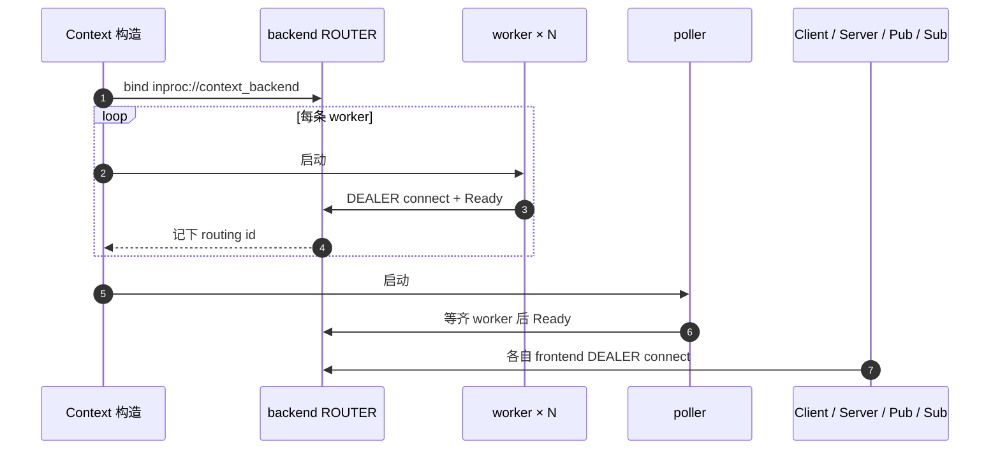

事件总线只传本进程 `Event*`（`sendPtr` / `recvPtr`），不另建队列。这条 inproc 不能改成 `tcp://` / `ipc://`。类型与投递见第 3 节。

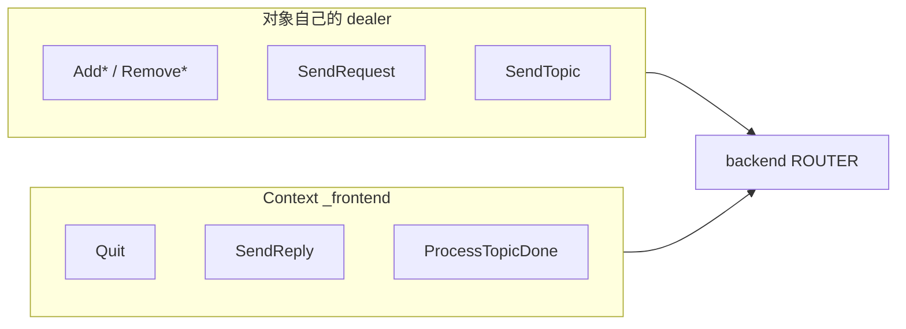

`Context` 的 `_frontend` 只给 `Quit` 以及 worker 回投 `SendReply` / `ProcessTopicDone`。对象自己的 dealer 走 `Add*` / `Remove*` / `SendRequest` / `SendTopic`。

---

## 3. 事件总线

跨线程动作一律 `new` 一个 `Event`，经 inproc DEALER/ROUTER 把指针字节拷进一帧。接收方 `recvPtr` 收成 `unique_ptr<Event>`，处理完析构。没有共享的队列，也没有序列化整份 `Event`。指针只在本 `Context`、本进程内有效。

Poller 是唯一分发器：`handleBackendSocket` 按 `EventType` switch。Worker 只处理 `ProcessRequest` / `ProcessReply` / `ProcessTopic` / `Quit`，其余类型丢掉。

### 3.1 投递路径

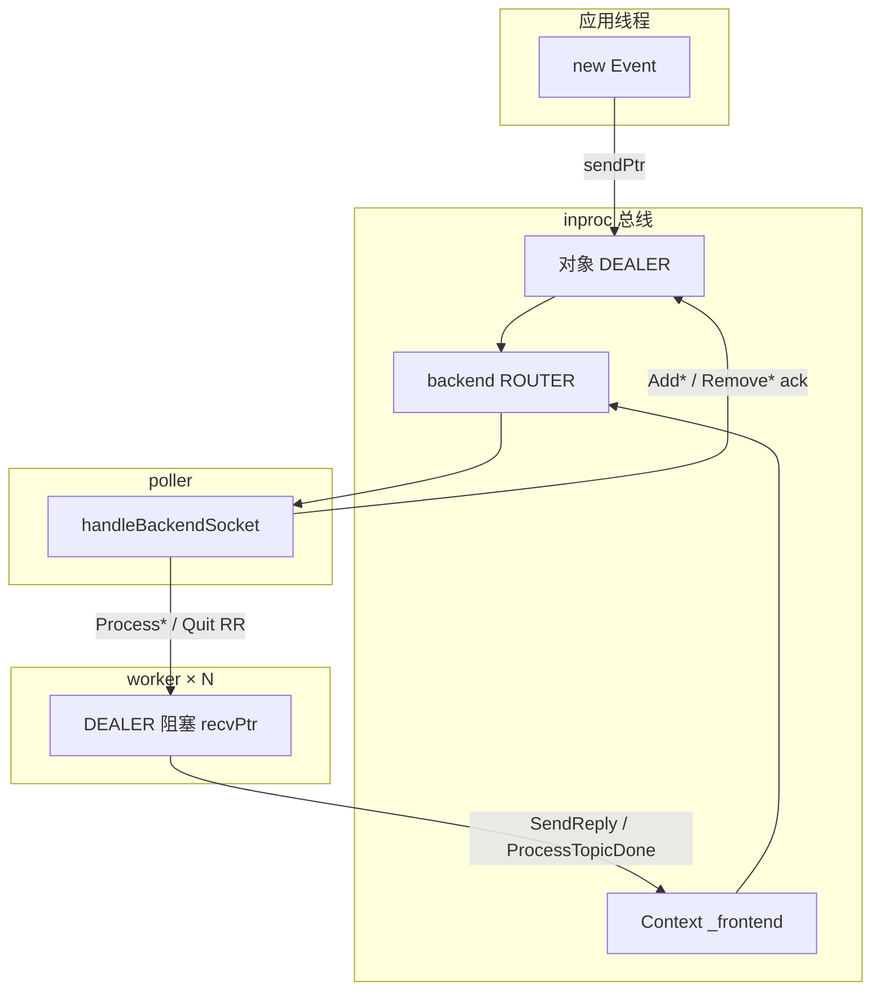

| 发出方 | 事件 | 接收方 |
|--------|------|--------|
| 对象各自的 DEALER | `Add*` / `Remove*` / `SendRequest` / `SendTopic` | poller |
| `Context::_frontend`（有锁） | `Quit`、worker 回投的 `SendReply` / `ProcessTopicDone` | poller |
| poller → worker（按条数 RR） | `ProcessRequest` / `ProcessReply` / `ProcessTopic` / `Quit` | 对应 worker |
| worker / poller 启动 | `Ready` | 构造线程握手 |

ROUTER 帧序：routing id、空 delimiter、指针帧。DEALER 发出时先塞空帧。`Add*` / `Remove*` 的回复**不是** Event，而是 `socketId` + error 字符串（`sendSocketEventAck`）。

### 3.2 类型

| `EventType` | 作用 | 等 ack |
|-------------|------|--------|
| `Ready` | worker / poller 启动握手 | 构造线程阻塞读一次 |
| `Quit` | 停 poller；poller 再 fan-out 给每个 worker | 否（随后 `join`） |
| `AddClient` / `AddServer` / `AddPub` / `AddSub` | 在 poller 上建 socket / session | 是（`socketId`，失败抛） |
| `RemoveClient` / `RemoveServer` / `RemovePub` / `RemoveSub` | 标 `Shutdown`，`postCallback` 摘 socket | 是（Server / Sub 两段，见 5.2） |
| `SendRequest` | 客户端请求进 poller | 否；结果走 `ProcessReply` |
| `SendTopic` | pub 进 poller 写出 | 否；失败 warn 丢掉 |
| `ProcessRequest` | 入站 RPC 交给 worker 跑 method | 否 |
| `SendReply` | worker 把回包交回 poller 写出 | 否 |
| `ProcessReply` | 回包 / 超时 / 断线 / `TryAgain` 进 worker：`complete` + 可选 `onComplete` | 否 |
| `ProcessTopic` | 入站 topic 交给 worker 跑订阅回调 | 否 |
| `ProcessTopicDone` | worker 通知 poller `--activeCalls` | 否 |

生命周期事件走对象自己的 DEALER，和热路径 `SendRequest` 同 FIFO，因此 `disconnect` 不会插到尚未发出的请求前面。

### 3.3 所有权与同步

发送方 `new`，接收方接管。ZMQ inproc 队列就是线程间交接；处理函数返回后 `unique_ptr` 释放。不要把 `Event*` 发到别的 `Context` 或本机之外。

- **打开 / 关闭**：发出后阻塞等 ack。Server / Sub 的 `Remove*` 先 ack「不再入队」，`wait()` 再等在飞的 method / topic 回调结束。
- **热路径**：`SendRequest` / `SendTopic` 发出即返回。`CallHandle::get()` 等的是 worker 上 `complete` 的 cv，不是事件 ack。
- **`Quit`**：poller 给每个 worker 再发 `Quit`，然后 `_poller->quit()`。此时不清 pending RPC，挂在 `get()` / `wait()` 上的调用不会被 `complete`。

`Context::_frontend` 被 poller 与多个 worker 共用，回投 `SendReply` / `ProcessTopicDone` / `Quit` 时加 `_frontendMutex`。对象自己的 DEALER 各有一把锁（Client / Publisher 可多线程发）。

---

## 4. 线程模型

poller 不跑用户 method。对外 socket `SNDTIMEO = 0`，发送失败立刻返回，不堵 poller。Worker 按条数 round-robin，不按耗时、不按 socket 保序。同一 method 会被多个 worker 同时调用，必须可重入或自行同步。

### 4.1 客户端一次 RPC

回包、超时、断线、`TryAgain` 一律经 `ProcessReply` 进 worker：`clientFunc` 里 `complete` 醒 `get()`；有 `onComplete` 则同一 worker 上接着跑。可以再 `callMethodAsync`，不要同步 `get()`，以免回包轮到同一 worker 自死锁。

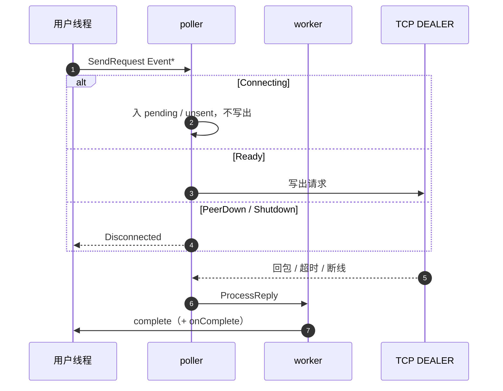

### 4.2 服务端一次 RPC

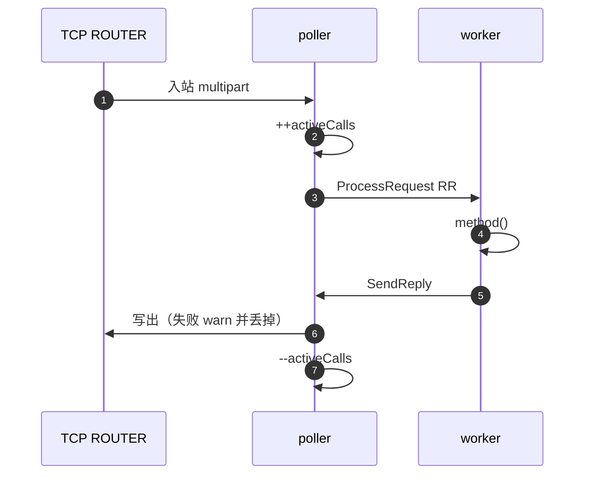

method / `onComplete` / topic 回调保证不抛。抛了则 `std::terminate`，且对应 `activeCalls` 不会 `--`，`wait()` 会一直等。

### 4.3 用户线程之间

- 一只 Client `connect` 之后可多线程 `callMethod` / `callMethodAsync`（dealer 有锁）。`Publisher::pubTopic` 同样可多线程。
- `bind` / `close` / `disconnect` 不要和 method / topic 回调并发。
- 别的线程还在同步 `call` 里时拆 Client 是 UB。异步已返回 handle 之后可以拆。

---

## 5. 对象与生命周期

头文件只前向声明 `*Private`，`std::unique_ptr` 的析构放在对应 `.cpp`。

### 5.1 会话状态

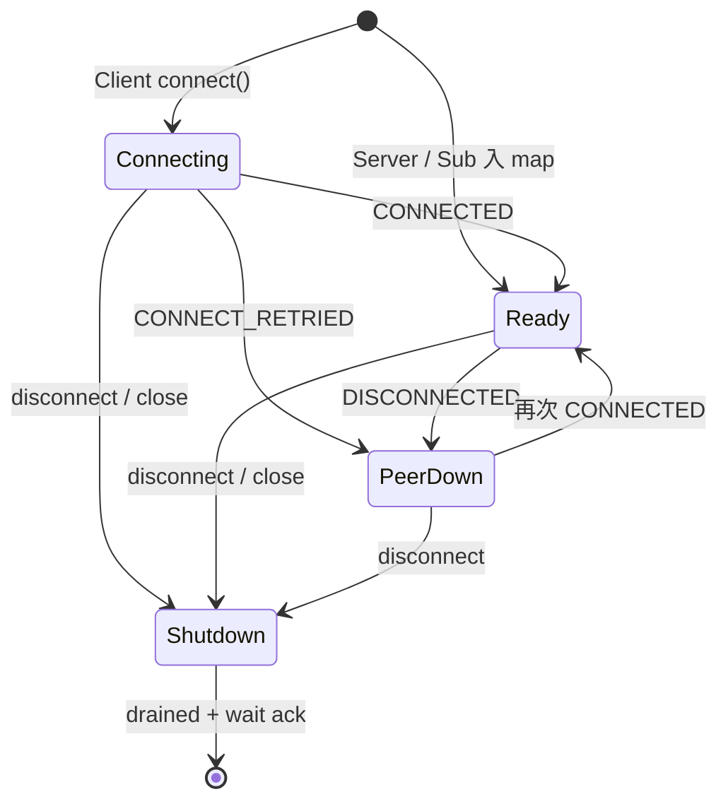

| 状态 | 谁用 | 含义 |
|------|------|------|
| `Connecting` | Client 默认 | 已 `socket->connect`，尚未 `CONNECTED` |
| `Ready` | 均可 | 可收发。Server / Sub 入 map 即为 Ready |
| `PeerDown` | 仅 Client | 对端掉线或首次拨号 `CONNECT_RETRIED`。新请求立刻 `Disconnected`，monitor 仍读 |
| `Shutdown` | 用户 close / disconnect | 同轮后到的入站不再入队 |

### 5.2 Server / Subscriber：两段 ack

同一只事件 DEALER，FIFO。析构 = `close`/`disconnect` + `wait()`，然后关 dealer，因此 callback 可以捕 `this`。

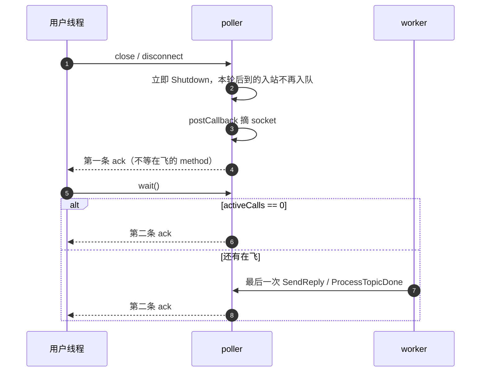

再 `bind` / `connect` 前先 `wait()`，避免上一次的第二条 ack 被读成新的打开回复。`listening` / `connected` 表示是否在听；`close`/`disconnect` 不清 `socketId`（留给 `wait`）。

### 5.3 Client / Publisher：一段 ack

`disconnect` / `close` 等一次 ack。Client 析构只 `disconnect`：pending RPC 全部 `Disconnected`，调用生命周期由 `CallHandle` 管理。Publisher 无用户回调。

关掉后 `socketId = 0`。未连接的 `callMethod` 立刻 `Disconnected`；未 bind 的 `pubTopic` 抛 `"not bound"`。已打开再 `bind` / `connect` 抛 `already bound` / `already connected`；关掉后可再打开。

### 5.4 Context 生命周期

`Context` 必须长于其上的 Client / Server / Subscriber / Publisher。先拆这些对象，再拆 Context。

`quit()` 停 poller / worker 后直接清表，不会 `complete(Disconnected)`。此时还挂着 `get()` / `wait()` 会一直等。

---

## 6. RPC

### 6.1 API

```
callMethod(service, method, Payload&&, CallOptions) → CallResult
callMethodAsync(...) → shared_ptr<CallHandle>   // 总是非空
```

`callMethod` = async + `handle->get()`。

`CallOptions.timeoutMs` 默认 `-1`（无限）。只有 `> 0` 才在 poller 上挂 `runCallbackAfter`。`get()` 本身不加第二套 `wait_for`：超时只走这一处 `complete(Timeout)`。

### 6.2 语义：at-most-once

一次调用要么成功一次，要么失败。库不重发已写出的请求。对不上的 `requestId` / 非法回包直接丢，不猜是哪一次调用，不主动 complete。未设超时时，回包对不上会一直等。

### 6.3 连接与第一笔 RPC

`connect()` 立刻返回，只 ack「dealer 建好并调用了 connect」，不代表 TCP 已就绪。第一笔 RPC 等这一次拨号。

必须先 `zmq_socket_monitor` + pair `connect(monitorAddr)`，再 `socket->connect(addr)`。否则本机已在听的端口会在挂上 monitor 前连上，错过 `CONNECTED`，session 一直停在 `Connecting`。

Monitor 订 `CONNECTED | DISCONNECTED | CONNECT_RETRIED`。不订 `CONNECT_DELAYED`（活着的对端也会 delay）。`PeerDown` 时不排队。

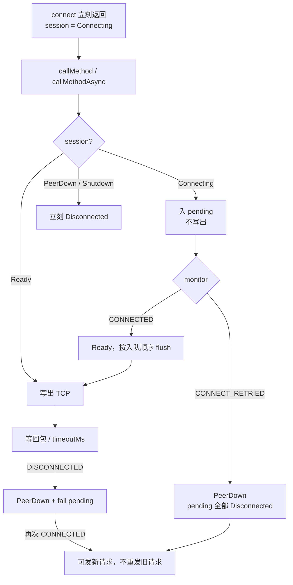

黑洞 / SYN 挂死可能迟迟没有 `CONNECT_RETRIED`，出口仍是 `timeoutMs`。

### 6.4 发送与回包

对外 dealer / router / pub：`LINGER = 0`，`SNDTIMEO = 0`。HWM 保持 ZMQ 默认 1000（计完整 multipart）。超时只在发送成功后挂。

| 路径 | 失败时 |
|------|--------|
| 客户端写出请求 | `ErrorCode::TryAgain`（请求未进 ZMQ） |
| 服务端 reply | 丢掉，打 warn，不堵 poller |
| pub topic | 丢掉，打 warn |

客户端要停下来仍靠 `timeoutMs` 或之后的 `Disconnected`。`SNDTIMEO = -1` 会堵死唯一 poller。

### 6.5 错误码

| `ErrorCode` | 何时 | 调用方 |
|-------------|------|--------|
| `Ok` | 回包成功 | — |
| `TryAgain` | 发送队列满，请求未进 ZMQ | 可立刻用同一参数再 `callMethod` |
| `Disconnected` | 未连接 / 断线 / 移除 Client / 首次拨号 fail-fast | 连接恢复后发**新**调用；在途视为失败，不假设未执行 |
| `Timeout` | `timeoutMs` 到期 | 结果可能未知（对端或已执行、回包丢 / 迟到被丢弃） |
| `InvalidMessage` | 头解不出、帧超限 | 不重试同一损坏包 |
| `NoSuchService` / `NoSuchMethod` | 服务端找不到 | 检查注册 |
| `CallInProcess` | 保留，现行路径不再产生 | — |

ZMQ 重连后同一只 `Client` 可继续发新 RPC，不必先 `disconnect` / `connect`。method 须可重入；幂等是应用责任。

### 6.6 端到端路径

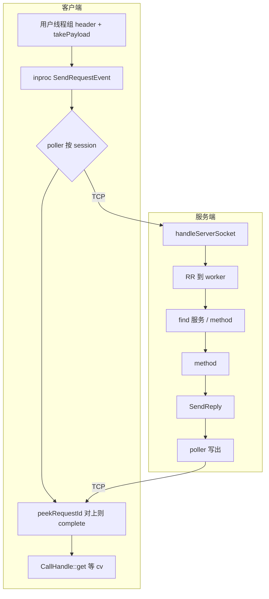

`clientFunc` 只捕 `CallHandle` 和 `onComplete`，不捕 Client。`>256B` 的 part 交给 ZMQ 自定义 free，不再 `memcpy`。

`registerService(std::unique_ptr<Service>)`：Server 唯一持有。bind 之后再 `registerService` 与 `processRequest` 并发改同一张 map 是数据竞争。未知服务名用 `find`，不往 map 里插空指针。

---

## 7. Pub / Sub

PUB 发 topic，尽力而为。慢订阅者、晚到的订阅者允许丢；发送失败丢掉。控制指令走 RPC。

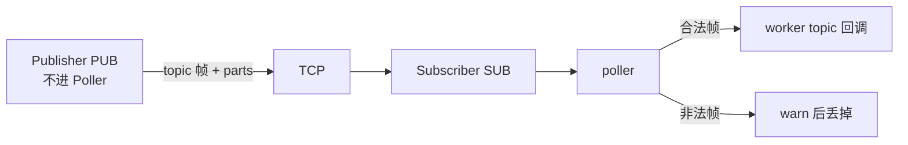

- Publisher 的 PUB socket 不进 Poller（只发不收）。
- `connect` 时对每个**非空** topic 调 `ZMQ_SUBSCRIBE`，不订 `""`。空列表或全是空字符串：不订任何前缀。
- 应用层仍**精确匹配** topic 字符串，避免 ZMQ 前缀订阅把 `"ab"` 配到 `"abc"`。
- `setCallback` 只在 `connect` 前调用，不保证线程安全。

---

## 8. Wire

整数按本机字节序写。无 magic、无 version、无 TLS。参与节点须 CPU 架构一致。

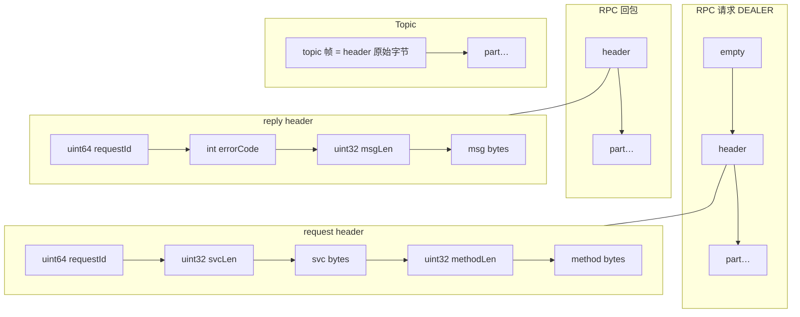

| 常量 | 值 |
|------|----|
| `kMaxPartBytes` | 1 GB（单帧） |
| `kZeroCopyThreshold` | 256 B（≤ 此值 `memcpy` 进 `zmq::message_t`） |

超限：`readRpcMessage` 置 `valid = false` 并排干剩余帧。`deserialize` 检查剩余字节，读完要求 `p == end`，失败返回 `nullopt`。

调用方 `std::move` 进 `Payload&&` 时，`takePayload` 只搬 string；`>256B` 不再拷字节。拷贝若发生，是在进 API 之前把别的缓冲装进 `std::string`。

`localhost` 在进 ZMQ 前会被归一成 `127.0.0.1`（部分平台上 `localhost` 会走 IPv6）。

---

## 9. Poller

`zmq_poll` + 定时器 + `postCallback`。

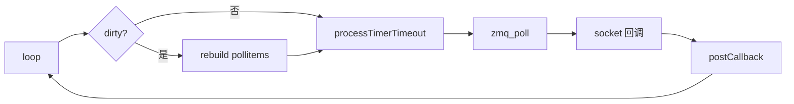

- 定时器时钟是 `steady_clock`（单调间隔），不跟墙钟。`system_clock` 会因 NTP / 改时间回拨或前跳。
- `runCallbackAfter` 给 RPC 超时用。
- `removeSocket` 放在 `postCallback`，避免改正在遍历的 poll 列表。
- `zmq_poll` 非 `ETERM` 失败时仍按 `revents` 回调。

---

## 10. 日志

库内 `spdlog`。热路径（poll 循环、每条 RPC / pub / 回包）不打日志。

- info：backend bind、worker / poller ready、对象打开成功
- warn：非法帧、reply / pub 发送失败
- error：bind / connect 失败、ready 对不上

---

## 11. 生产注意事项

### 超时

默认 `timeoutMs = -1` 会一直等。服务端卡住、回包因 HWM 被丢、半开连接尚未 `DISCONNECTED` 时，`get()` 不会自己回来。除确知 method 很长且可接受阻塞外，**每次调用显式设 `timeoutMs > 0`**，按业务 P99 留余量。

### 半开连接

库没有 TCP keepalive / ZMQ heartbeat。对端无 RST 时，`DISCONNECTED` 可能很久不来。有 RPC 在飞时靠 `timeoutMs` 兜底；空闲长连接的假活可能持续到内核或 ZMQ 最终断线。需要更快探测时，由应用发轻量 ping method。

### 重试与幂等

库不自动重试。`TryAgain` 表示请求没进 ZMQ，可立刻重发。`Disconnected` 之后发新调用，不要假设在途请求未执行。`Timeout` 时对端可能已经做完，写操作必须业务幂等或先查状态。

### 部署拓扑

header 按本机字节序、无 TLS。节点须同 CPU 架构、处于可信网络。混 x86 / ARM 会解不出头；公网暴露可被嗅探。

### 线程与生命周期

先拆 Client / Server / Publisher / Subscriber，再拆 Context。不要在 method / `onComplete` / topic 回调里 `wait()` 或销毁同一个对象。`onComplete` 里不要同步 `get()`。`Subscriber::setCallback` 只在 `connect` 前设置。bind 之后不要并发 `registerService`。

### 背压

`SNDTIMEO = 0`。客户端队列满返回 `TryAgain`；服务端 reply / pub 失败只 warn 并丢掉，调用方会走到超时或断线。HWM 默认 1000 条完整 multipart。突发流量过大时调发送节奏，或让调用方对 `TryAgain` 做有限次重试。

### Pub / Sub

慢订阅者和晚加入者会丢消息。不要把控制指令放在 topic 上。订阅后稍等再发（slow joiner），或接受前几条可能丢失。

### 地址与对象

一只对象一个地址。`connect()` 返回不代表已连上，第一笔 RPC 才等这次拨号。对端未听时第一笔会 `Disconnected`。ZMQ 会自行重连，同一只 Client 恢复后可继续用。地址里写 `127.0.0.1` 比 `localhost` 更稳妥。
